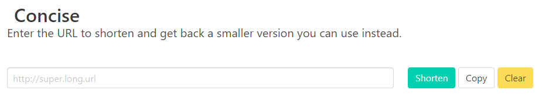

<h1 align="center">Concise</h1>

<div align="center">
	
</div>


<div align="center">
	<strong>Web apps without hosting</strong>
</div>

<div align="center">
	Part of <a href=https://github.com/Pebaz/FragmentTheory>Fragment Theory</a>.
	Shorten very long URLs.
</div>




### Quickstart

First, head over to [JsonStore.io](https://www.jsonstore.io/) and get yourself an endpoint to store JSON.

##### Host locally

```bash
git clone https://github.com/Pebaz/Concise
cd Concise

# Set the environment variable for the JSON store:
# (i.e. in PowerShell):
$ENV:DATABASE_URL="<your endpoint URL>"

pip install -r requirements.txt
python index.py
```

##### Host on Heroku (free tier)

```bash
# First go to https://dashboard.heroku.com/apps/<your app>/settings
# and add the "Config Var"s:
# KEY          VALUE
# host         <your app>.herokuapp.com
# DATABASE_URL <your JsonStore endpoint>
heroku git:remote -a <the app name that you went and created on Heroku>
git push heroku master
```

### About

Concise is a URL shortener built using Python (programming language), Flask (web framework), JsonStore.io (JSON database), and optionally Heroku (cloud hosting).  When given a URL, Concise puts that URL in the JsonStore database along with a unique identifier.  This identifier can be used to lookup the long URL and redirect to it in your browser *or  even from scripts or other resources!*

This means that if you are creating a [Pity](https://github.com/Pebaz/Pity) page and storing it in the URL fragment, you only have [2000 bytes total](https://github.com/alcor/itty-bitty) to work with on the page.  While this likely is ample room for creating an interesting page, it also means that if you link to resources such as images or scripts on say, a CDN, the URL for that resource will take up a lot of the 2000 byte limit.  In order to circumvent this, you can use Concise to shorten these URLs to make your page smaller while still linking to CSS frameworks, etc.

A perfect companion for Concise is [Pity](https://github.com/Pebaz/Pity), a tool to create entire web pages of arbitrary size (if you choose to not store the page in the URL fragment).  In essence, you can use Pity to create a single static web page that could be very large, and then share that link with someone.  However, that link will be extremely long.  Using Concise, you can shorten that URL and then hand them just a few characters long hyperlink.

### Features

* Shorten super long URLs.
* Generate QR code for generated URL.
